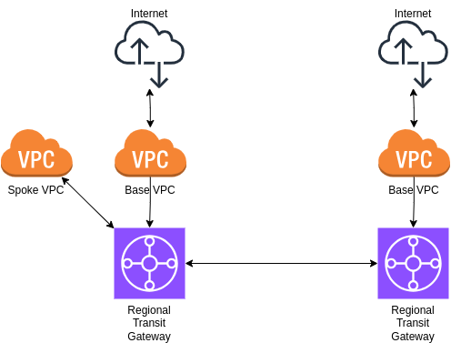

# aws-nac
AWS Network as Code

This repository is for creating an AWS network fully from code with a view of having it managed by NetOps, DevOps and SecOps people all together.  

Included so far:
- 2 Regional Transit Gateways
- 2 Regional Base VPCs for shared services and Internet access
- 1 Spoke VPC for an application

# NetOps - how?
After stages 1 & 2 (explanation below) are deployed, DevOps people can fork the repository and create pull requests to deploy their spoke VPCs.

When used on Terraform Cloud, a Github workflow can be created where new commits (after reviewing pull requests) automatically trigger deployment.

This allows for the topology to be 'democratised' (i.e. enable anyone to suggest changes). DevOps teams can include the code in their application repositories and create pull requests from there.

With the Terraform state file also checked into the repository, NetOps teams can work together knowing they always have access to the latest state of the network.

# Topology



## Regional base VPC


## Spoke (Application) VPC


# How to use
The repository consists of:
- Python scripts to interface with an instance of phpipam and produce a JSON file with network information (3 examples already included)
- Multi-stage terraform deployment

The deployment must be done in 3 stages due to technical constraints.  
Each of the stages is clearly marked in both `main.tf` and `outputs.tf`; simply uncomment the next stage after each init, plan, apply sequence.

## Quick start
```
terraform init
terraform plan
terraform apply -auto-approve
```

## Pre-requisites
This deployment is meant to run on a Linux CLI environment with the following software installed and configured:
- [Terraform](https://developer.hashicorp.com/terraform/install)
- [AWS CLI v2](https://github.com/aws/aws-cli/tree/v2)

## Good to have
The below tools are good to have for more advanced play
- [Python 3](https://www.python.org/downloads/)
- [My phpipam-docker](https://github.com/peetvandesande/phpipam-docker)

## Further explanation
Everything stars with the AWS CLI being installed and configured.  

Including credentials and default region.  

In Terraform, AWS regions are mentioned specifically using provider aliases.

The Python scripts `ipam-hub.py` and `ipam-spoke.py` are used to interface with an instance of phpIPAM [link to my repository for a fully working version](https://github.com/peetvandesande/phpipam-docker) and create a JSON file with network information.  

The 'hub' file will produce output for a regional hub, the 'spoke' file produces output for a spoke that must connect to a hub.

A phpipam.json file containing a token and URL is required and an example provided.

For the moment, files for 2 hubs and 1 spoke are included.

Python quick-start to create venv and install packages:
```
python3 -m venv .venv
source .venv/bin/activate
pip install -r requirements.txt
python ipam-hub.py
python ipam-spoke.py
```

In order to progress through the Terraform stages, find the respective headings for each one (conveniently marked 'Stage 2' and 'Stage 3') and from there on down to the end remove '# ' at the begin of each line.


# Feedback
For feedback about this repo, wanting to buy me a Ducati or hire me, my contact details are in my profile.  

Alternatively, create a pull request here.